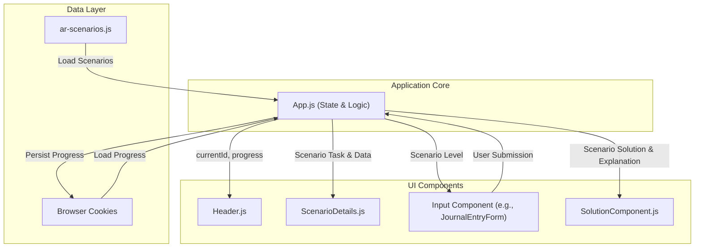

# Accounting Practice Tool - Application Overview

This document provides a detailed breakdown of how the React-based accounting practice application works, from its architecture to its data structures.

### Application Architecture and Core Components

This React application is designed as a single-page practice tool for accounting students. It presents a series of problems (scenarios) and allows users to submit answers, receive immediate feedback, and review detailed solutions.

Here are the key components and their roles:

1.  **`App.js` (The Conductor):**
    *   This is the main component that orchestrates the entire application.
    *   **State Management:** It holds all the critical state, including the list of all scenarios, the `currentId` of the scenario being viewed, and the `completedScenarios` object that tracks user progress.
    *   **Lifecycle and Logic:** It handles navigating between scenarios, validating user submissions (`handleSubmission`), marking scenarios as complete, and saving/loading progress using browser cookies.

2.  **Data Files (e.g., `src/data/ar-scenarios.js`):**
    *   These files are the heart of the app's content. Each file is a JavaScript array containing multiple "scenario" objects. Each object represents a single accounting problem with all its associated data, questions, and solutions.

3.  **`ScenarioDetails.js` (The Problem Statement):**
    *   This component's job is to display the question. It receives the current scenario object from `App.js` and renders the `task` field, which is the prompt for the user.

4.  **Input Components (e.g., `BadDebtCalc.js`, `JournalEntryForm.js`):**
    *   These are the interactive forms where the user inputs their answer.
    *   The application uses a router (`src/utils/componentRouter.js`) to dynamically select which input component to show based on the current scenario's `level`. For instance, `level: 1` problems use a simple numeric input, while `level: 2` problems use a multi-line journal entry form.

5.  **`SolutionComponent.js` (The Answer Key):**
    *   When the user requests the answer, this component is displayed.
    *   It takes the current scenario object and formats the `explanation` field into a readable, step-by-step guide. It uses `ReactMarkdown` to render text, code blocks, and custom-styled journal entry tables.

6.  **`cookieManager.js` (The Memory):**
    *   This utility saves the user's progress (`currentScenarioId` and `completedScenarios`) into the browser's cookies. When you close the app and reopen it, this allows you to pick up right where you left off.

### The Structure of a Scenario Object

Every problem in the application is defined by a JavaScript object with a consistent structure. This schema allows the components to easily parse and display the information. Here is a breakdown of the keys in a typical scenario from `ar-scenarios.js`:

```javascript
{
  // Unique identifier for navigation and progress tracking.
  id: "AR-01",

  // The accounting topic (e.g., 'ar' for Accounts Receivable).
  topic: "ar",

  // Determines the problem type and which input component to load.
  // Level 1: Numeric answer (e.g., calculate a single value).
  // Level 2: Journal entry answer.
  level: 1,

  // The question or instruction presented to the user.
  task: "Calculate bad debt expense using the percentage‑of‑credit‑sales method.",

  // An object containing all the raw numbers and data needed to solve the problem.
  data: {
    creditSales: 500000,
    estimatedBadDebtRate: 0.03
  },

  // An object defining the correct answer for validation.
  solution: {
    // The type of solution, matching the 'level'.
    type: "numeric",
    // The correct numeric value.
    value: 15000,
    // The margin of error allowed for the user's answer.
    tolerance: 1,
    // A label for the numeric solution.
    label: "Bad Debt Expense"
  },

  // A detailed, step-by-step explanation of the theory, calculation, and journal entries.
  // This is a markdown string that gets rendered in the SolutionComponent.
  explanation: "### Theory: ...\n\n### Calculation\n...",

  // A short message displayed to the user upon successful completion.
  successMessage: "Correct—the percentage‑of‑sales method gives 15000."
}
```

### Component and Data Flow Diagram

This diagram illustrates how data flows from the main `App.js` component to the various child components.


